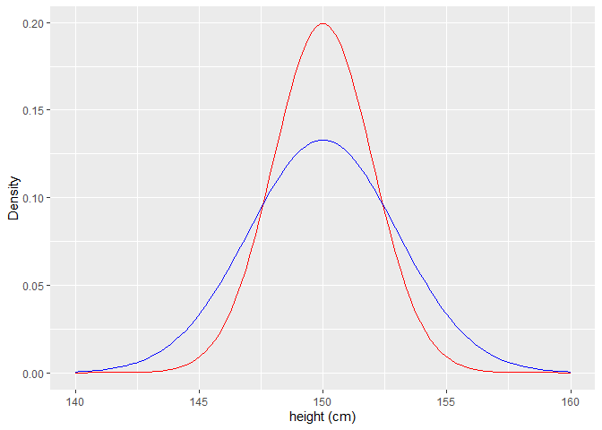
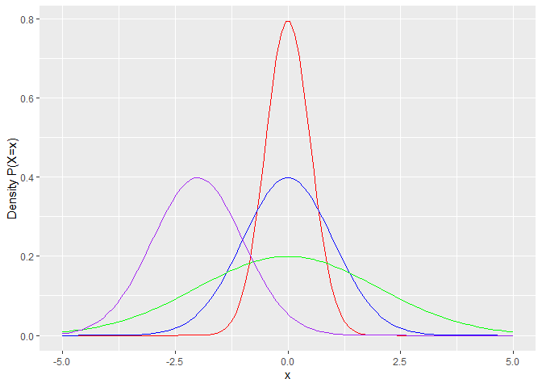
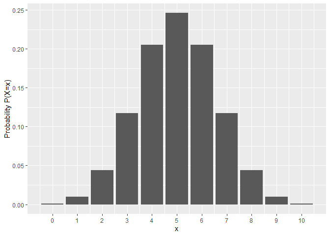
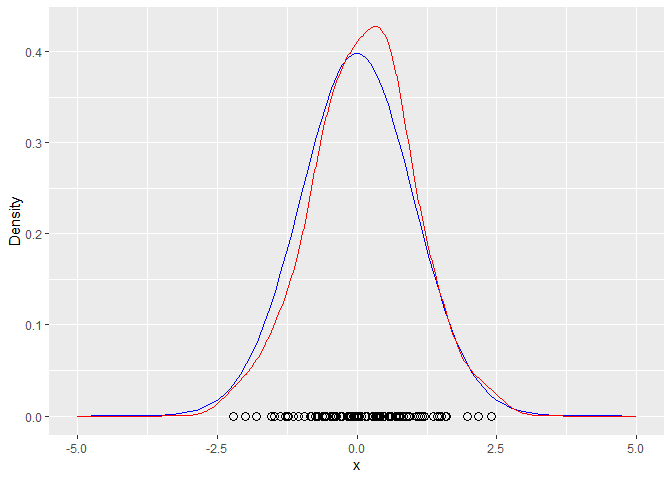
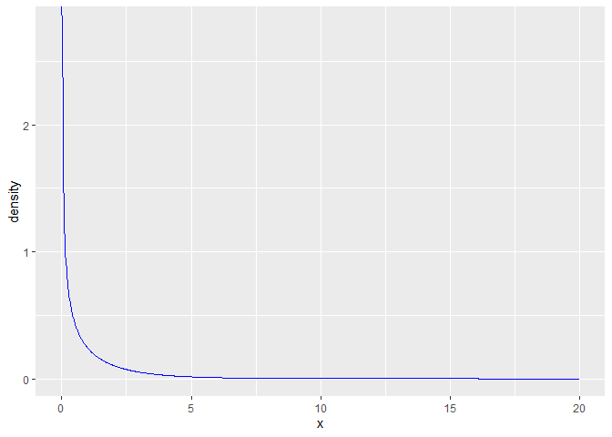
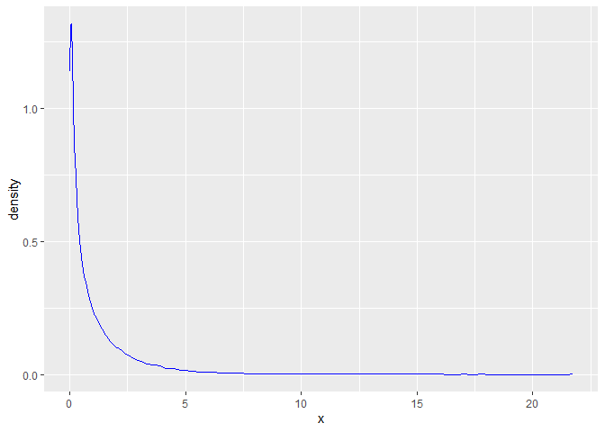
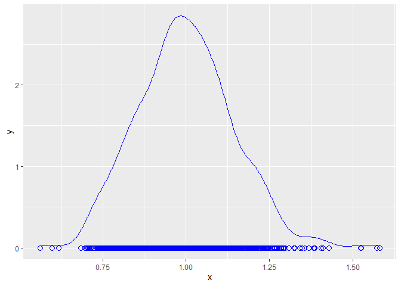

# STAT 540 - Seminar 3: Getting your hands dirty with R, probability and simulations

## Attributions

This seminar was developed by [Eric Chu](https://github.com/echu113) and
Keegan Korthauer.

## Learning Objectives

By the end of this seminar, you should

-   have a clear understanding of what a normal distribution, its
    associated parameters (mean & standard deviation), as well as the
    consequential probability density and cumulative distribution
    functions
-   have a clear understanding of the Central Limit Theorem (CLT)
-   have practical experience exploring the aforementioned concepts in
    statistics by simulating data and building visualizations

## Packages required

Just like last seminar, we’ll use the
[tidyverse](http://tidyverse.tidyverse.org/) package (so this should
already be installed, if not, refer to the last week’s seminar
materials).

``` r
library(tidyverse)
```

    ## Warning: package 'tidyverse' was built under R version 4.0.5

    ## -- Attaching packages --------------------------------------- tidyverse 1.3.1 --

    ## v ggplot2 3.3.3     v purrr   0.3.4
    ## v tibble  3.1.0     v dplyr   1.0.5
    ## v tidyr   1.1.3     v stringr 1.4.0
    ## v readr   1.4.0     v forcats 0.5.1

    ## -- Conflicts ------------------------------------------ tidyverse_conflicts() --
    ## x dplyr::filter() masks stats::filter()
    ## x dplyr::lag()    masks stats::lag()

Remember from last seminar that this command will tell you which
functions from the tidyverse conflict with functions in base R (or from
other packages you might have loaded).

We’ll also load a package that will help with providing you feedback on
the exercises (`testthat`), and a package for easily adjusting axes tick
labels in ggplot (`scales`). If you don’t have these packages, first
install them with `install.packages("testthat")` or
`install.packages("scales")`).

``` r
suppressPackageStartupMessages(library(testthat))
```

    ## Warning: package 'testthat' was built under R version 4.0.5

``` r
suppressPackageStartupMessages(library(scales))
```

## New functions used

-   **base::seq()** - Generate sequence of numbers given some pattern.
-   **tibble::tibble()** - Constructs a tibble (a matrix-like data frame
    object / table) given data.
-   **base::matrix()** - Constructs a matrix from a vector by specifying
    numbers of rows/columns
-   **stats::pnorm()** - Cumulative distribution function for the normal
    distribution.
-   **stats::dnorm()** - Probability density function for the normal
    distribution.
-   **stats::rnorm()** - Random number generator for sampling values
    from the normal distribution.
-   **stats::dchisq()** - Cumulative distribution function for the
    chi-square distribution.
-   **stats::rchisq()** - Random number generator for sampling values
    from the chi-square distribution.
-   **ggplot2::geom\_line()** - Geom function for drawing lines.

## Statistical concepts and terminology

-   **Probability distribution** - Describes the probabilities of all
    possible values in a given scenario.
-   **Mean** - One of two parameters used to describe a normal
    distribution; it is the average value, and also the value with the
    highest probability.
-   **Standard deviation** - One of two parameters used to describe a
    normal distribution; it describes the spread of the data.
-   **Probability density function** - Maps the values x (possible
    heights in our example) to its associated probability described by a
    given distribution.
-   **Cumulative distribution function** - Describes the cumulative
    probability of all values smaller than x; x starts a 0 and goes up
    to 1.
-   **Central limit theorem (CLT)** - States that the distribution of
    the sum or means of random samples generated independently (IID) by
    any distribution will converge to the normal distribution.
-   **Independent and identically distributed (IID)** - Each random
    value is sampled with replacement from the same distribution.

## Part 1: The normal distribution

The normal (or Gaussian) distribution is one of the most useful
distributions in statistics. Turns out, many things in the world
naturally follow a normal distribution. With this simple and (for the
most part) reasonable assumption, we can go quite far!

In this section, we will explore the properties of the normal
distribution using R. Along with the normal distribution, you will also
gain important skills and experience working with probability
distributions in general in the R environment.

First, we introduce the normal distribution. Next, we look its
corresponding probability density and cumulative distribution functions.
Lastly, we use the random number generator to simulate data from the
normal distribution. Along the way, we will showcase many of commonly
used features of R.

### What is the normal distribution?

A probability distribution describes the probabilities of all possible
values in a given scenario. For example, if you randomly select a person
from the UBC student database, what is the probability that this
person’s height is &gt;150cm? &lt;200cm? somewhere in between? These are
the types of questions that a probability distribution can help answer.

The *mean* and the *standard deviation* are the two parameters used to
describe a normal distribution. Respectively, these two numbers describe
the average value (which also happens to be the one with the highest
probability), and the spread of the data. If the standard deviation is
small, it means that heights among students are less variable and
generally cluster more closely around the mean. As a consequence, the
probability estimate would change more dramatically with a small change
in height. On the other hand, if the standard deviation is large, it
means that heights are more spread out.

To illustrate this, here is a visualization showing two normal
distributions. The blue line plots the probability distribution of a
normal distribution with a larger standard deviation (more spread)
whereas the red line plots one with a smaller standard deviation (less
spread). Both distributions have a mean of 150.

Ignore the details of the code for now.

``` r
# simulate height values
all_possible_heights <- seq(from = 140, to = 160, length = 100)
probability_values_less_spread <- dnorm(all_possible_heights, mean = 150, sd = 2)
probability_values_more_spread <- dnorm(all_possible_heights, mean = 150, sd = 3)

# put these values in a tibble.
dat <- tibble(height = all_possible_heights, 
       probability_less_spread = probability_values_less_spread,
       probability_more_spread = probability_values_more_spread) 

# plot
ggplot(dat) +
  geom_line(aes(x = height, y = probability_less_spread), color = "red") +
  geom_line(aes(x = height, y = probability_more_spread), color = "blue") +
  xlab("height (cm)") +
  ylab("Density")
```

<!-- -->

### The probability density function

These plots are visualizations of the normal distribution’s probability
density function. It is a function that maps the values *x* (possible
heights in our example) to its associated probability described by the
distribution. In general, you can see that the probability decreases as
values deviate from the mean; in the normal distribution, the mean value
has the highest probability and the probability density function is
symmetrical. The normal distribution is an example of a **continuous**
probability density. Because there are infinite values that the height
variable could assume, the probability of height taking on any one exact
specific value is zero. For this reason, we speak in ranges of values.

So in the chart above, we can see that the probability of a person we
pick at from the red curve at random having a height greater than 150 cm
is less than that same probability for a person picked at random from
the blue curve. To obtain the probability values, we would integrate
under the curves the area to the right of 150 cm.

Here are a few more probability density plots for the normal
distribution with different means and standard deviations. We recommend
that you try running the code line by line so that you understand
exactly what happens every step of the way!

From the code, can you figure out which color corresponds to which set
of parameters? (mean & standard deviation)

``` r
# simulate values
xValues <- seq(from = -5, to = 5, length = 100)
plotA <- dnorm(xValues, mean = 0, sd = 0.5) #
plotB <-  dnorm(xValues, mean = 0, sd = 1)
plotC <-  dnorm(xValues, mean = 0, sd = 2)
plotD <-  dnorm(xValues, mean = -2, sd = 1)

# place in a tibble
normalDistributionsTibble <- tibble(x_value = xValues, 
                                    red_value = plotA,
                                    blue_value = plotB,
                                    green_value = plotC,
                                    purple_value = plotD)

# plot
ggplot(normalDistributionsTibble) +
  geom_line(aes(x = xValues, y = red_value), color = "red") +
  geom_line(aes(x = xValues, y = blue_value), color = "blue") +
  geom_line(aes(x = xValues, y = green_value), color = "green") +
  geom_line(aes(x = xValues, y = purple_value), color = "purple") +
  xlab("x") +
  ylab("Density P(X=x)")
```

<!-- -->

Notice that in R, we can very easily obtain the normal probability
density function for any set of parameters, simply by using the
`dnorm()` function. Similar functions are available for other
distributions. For example, `dunif()` for the uniform distribution, and
`dchisq()` for the chi-square distribution.

### The probability mass function (PMF)

Just like the continuous distributions (e.g. Normal, chi-square),
discrete distributions also have a function that maps possible values to
a probability: **the probability mass function**. Unlike in the
continuous case, where there are infinite possible values of a random
variable, here every possible value of the random variable is associated
with a probability value.

As an example, let’s look at the probability mass function for the
binomial distribution. A binomial random variable counts how often a
particular event occurs in a fixed number of trials. The binomial
distribution is a discrete distribution that is characterized by two
parameters: *n* (the number of trials) and *p* (the probability that the
event occurs). As an example, you can think of the distribution of the
number of heads in 10 coin tosses as a binomial random variable with
*n* = 10 and *p* = 0.5. The `dbinom()` function here helps us find the
probability of 6 heads.

``` r
n <- 10
p <- 0.5

# probability of getting 6 heads in 10 tosses
dbinom(6, size = n, prob = p)
```

    ## [1] 0.2050781

Then we can plot the (PMF)

``` r
# create a grid of values 0 to 10 and calculate binomial PMF
x <- seq(0,n)
prob <- dbinom(x, size = n, prob = p)

# place in a tibble
densTable <- tibble(x = x, 
                    prob = prob)

# plot
ggplot(densTable) +
  geom_col(aes(x = x, y = prob)) +
  xlab("x") +
  ylab("Probability P(X=x)") +
  scale_x_continuous(breaks = scales::pretty_breaks(11))
```

<!-- -->

**Exercise**: take a couple of minutes to explore the `dbinom()`
function. Find the probability of getting a run of 4 heads out of 4 coin
flips.

``` r
# your code here 
prob <- "FILL_THIS_IN"
```

This next code chunk will test whether you have correctly calculated
`prob` in the previous chunk. The answer is hidden as an encrypted hash,
but the function will return `Test passed`.

``` r
test_that("Probability Calculation with PM:", 
          expect_known_hash(prob, "e674f477275ebe3bc0f0ee9228194518"))
```

    ## -- Failure (???): Probability Calculation with PM: -----------------------------
    ## Value hashes to 917adccf7b1791212ddff570523f2736, not e674f477275ebe3bc0f0ee9228194518

    ## Error: Test failed

### The Cumulative Distribution Function (CDF)

The cumulative distribution function is an alternative way of describing
the distribution. We will not go into a lot of details on how it can be
used. Just briefly, it describes the cumulative probability of all
values smaller than *x*. This is why it starts at 0 and goes up to 1, as
the probability of all values smaller than *x* grows with *x*. The slope
corresponds to the spread. Lower standard deviations would correspond to
more rapid growth in the CDF.

Note that the values of CDF for the normal distribution can also be very
easily generated in R using the `pnorm()` function. Similarly, this
function exists for many other distributions: `punif()` for the uniform
distribution, `pchisq()` for the chi-square distribution, and `pbinom()`
for the binomial distribution.

Here we show the visualization of CDFs for the normal distribution with
different means and standard deviations.

``` r
# simulate values
xValues <- seq(from = -5, to = 5, length = 100)
plotA <- pnorm(xValues, mean = 0, sd = 0.5)
plotB <-  pnorm(xValues, mean = 0, sd = 1)
plotC <-  pnorm(xValues, mean = 0, sd = 2)
plotD <-  pnorm(xValues, mean = -2, sd = 1)

# place in a tibble
normalDistributionsTibble <- tibble(x_value = xValues, 
                                    red_value = plotA,
                                    blue_value = plotB,
                                    green_value = plotC,
                                    purple_value = plotD)

# plot 
ggplot(normalDistributionsTibble) + 
  geom_line(aes(x = xValues, y = red_value), color = "red") +
  geom_line(aes(x = xValues, y = blue_value), color = "blue") +
  geom_line(aes(x = xValues, y = green_value), color = "green") +
  geom_line(aes(x = xValues, y = purple_value), color = "purple") +
  xlab("x") +
  ylab("f(x)")
```

<!-- -->

Notice here that we use the `tibble()` function to create our table of
data for plotting. A [tibble](https://tibble.tidyverse.org/) is like a
data frame (observations in rows, features in columns), and is a core
type of object of the tidyverse.

If we want to find the probability that a standard normal random
variable *x* is less than -1 *P*(*X* &lt;  − 1), we can use the
`pnorm()` function:

``` r
pnorm(-1)
```

    ## [1] 0.1586553

**Exercise**: take a minute to calculate the probability that a normal
random variable *x* with mean 0.5 is *greater* than 1. (Hint:
Probability distributions have a total area of 1 and are symmetric about
the mean, i.e. *P*(*X* &gt;  − 1) = 1 − *P*(*X* &lt;  − 1) )

``` r
# your code here 
prob <- "FILL_THIS_IN"
```

This next code chunk will test whether you have correctly calculated
`prob` in the previous chunk. The answer is hidden as an encrypted hash,
but the function will return `Test passed`.

``` r
test_that("Probability Calculation with CDF", 
          expect_known_hash(prob, "78dcd0f9535233065cb718a9938312dd"))
```

    ## -- Failure (???): Probability Calculation with CDF -----------------------------
    ## Value hashes to 917adccf7b1791212ddff570523f2736, not 78dcd0f9535233065cb718a9938312dd

    ## Error: Test failed

### Simulation vs. perfect distribution

Finally, here we introduce R’s random number generator. In R, we can
sample values from the normal distribution easy using the `rnorm()`
function.

Here we demonstrate usage of this function. We overlap the resulting
density plot with true distribution. Notice how they line up :)!

``` r
# distribution parameters
meanValue <- 0
standardDeviation <- 1
numVals <- 100

# create grid of (true) cumulative distribution values
xValues <- seq(from = -5, to = 5, length = numVals)
trueDistribution <- dnorm(xValues, mean = meanValue, sd = standardDeviation)

# sumulate random values from the normal distribution
set.seed(1)
randomVals <- rnorm(numVals, mean = meanValue, sd = standardDeviation)

# place in tibble
datTrue <- tibble(x_value = xValues, true_value = trueDistribution, randomVals = randomVals)

# plot
ggplot(datTrue) +
    geom_line(aes(x = x_value, y = true_value), color = "blue") +
    geom_line(aes(x = randomVals), color = "red", stat = "density") +
    geom_point(aes(x = randomVals, y = 0), color = "black", shape = 1, size = 3) +
    ylab("Density") +
    xlab("x")
```

<!-- -->

Notice the call to `set.seed()` in the previous code chunk: this is a
trick to make the random values reproducible - note that computers are
unable to produce truly random values. They can only generate
pseudorandom values by using a seed, usually the current time, as it
varies from moment to moment. By setting the seed ourselves, we make the
random values repeatable. You can use any number as the seed.

And you guessed it, we can sample from other distributions using similar
functions. For example, `runif()` is the random number function used to
sample from a uniform distribution, `rchisq()` can be used to sample
from the chi-square distribution, and `rbinom()` generates random
samples from the binomial distribution.

## Part 2: The Central Limit Theorem (CLT)

### What is the central limit theorem?

The Central Limit Theorem (CLT) is one of the most exciting concepts in
statistics. It states that the distribution of the sum or means of
random samples generated independently (IID) by any distribution will
converge to the normal distribution. Note that the independent and
identically distributed (IID) assumption simply means that each random
value is sampled independently from the same distribution.

Below, we demonstrate the Central Limit Theorem by generating random
samples from the chi-square distribution and show that the sample means
are normally distributed.

A **sample** is defined as a collection of random values generated from
a distribution. For example, we can generate 100 samples of size n = 5
from the chi-square distribution. This would essentially be the same as
sampling 500 independently and identically distributed values and
sorting them into 100 groups. Sample means are the average values
corresponding to each sample of size n = 5. In this case, we would have
100 sample means.

The Central Limit Theorem states that these 100 sample means would
follow a normal distribution regardless of the underlying distribution
from which the original random values were sampled.

### The chi-square distribution

To demonstrate the CLT, we will generate the original sample values from
the chi-square distribution. But first, let’s see what the chi-square
distribution looks like.

``` r
degreeFreedom <- 1

xValues <- seq(from = 0, to = 20, length = 1000)
densityValues <- dchisq(xValues, df = degreeFreedom)

dataFrame <- tibble(x = xValues, 
                    density = densityValues)

ggplot(dataFrame) +
  geom_line(aes(x = x, y = density), color = "blue")
```

<!-- -->

Note that it looks absolutely *nothing* like the normal distribution.
That’s what makes the CLT so exciting!

### Simulating many samples

Similar to what we did in Part 1 for the normal distribution, random
values can be generated from the chi-square distribution using the
function `rchisq()`.

We will now generate 1000 samples; each sample will consist of 100
random values. We then calculate the sample means for each of the 1000
samples generated. We then look at the distribution of the 1000 means
values.

``` r
set.seed(1)

sampleSize <- 100
numSamples <- 1000

degreeFreedom <- 1

randomChiSqValues <- rchisq(n = numSamples * sampleSize, df = degreeFreedom)
```

First let’s take a look at the distribution of all randomly generated
values. This is 100 \* 1000 = 100000 values sampled from the chi-square
distribution.

``` r
randChiSq <- tibble(x = randomChiSqValues) 

ggplot(randChiSq) + 
  geom_density(aes(x = x), color = "blue")
```

<!-- -->

So, yes, of course it resembles the chi-square distribution. The values
were sampled from it! Nothing too exciting yet…

### Convergence to the normal distribution - what an amazing property!

Ok, now let’s separate all these values into 1000 samples, and then work
out the sample means and look at the distribution of that.

``` r
# organize the random values into 1000 sample rows of size n = 5 columns
samples <- matrix(randomChiSqValues, nrow = numSamples, ncol = sampleSize)

sampleMeans <- rowMeans(samples) # work out the sample means 

head(sampleMeans)
```

    ## [1] 1.0797031 1.1752284 0.9261440 0.9416424 0.9380011 1.1191603

Great, now we have the sample means. Let’s check their distribution.

``` r
dat <- tibble(x = sampleMeans)  

ggplot(dat) + 
  geom_line(aes(x = x), stat = "density", color = "blue") +
  geom_point(aes(x = x, y = 0), color = "blue", shape = 1, size = 3)
```

<!-- -->

… and TADA. Sample means of random samples generated from the chi-square
distribution converges to the normal distribution. How amazing is that?!

## Important takeaway

Every distribution in R comes with three different functions,
p-function, d-function, and r-function. The p-function is the
probability density function, the d-function is the cumulative
distribution function, and r-function is the random number generator
that can be used to sample IID values from the given distribution.

For the normal distribution, the three functions correspond to
`pnorm()`, `dnorm()`, and `rnorm()`. We have used all three for the
normal distribution in this seminar. We have also discussed
corresponding functions for the chi-square distribution, the uniform
distribution, and the binomial distribution. When you get a chance, feel
free to explore these functions for different distributions for
yourself.

# Part 3: Deliverable

-   How well does the CLT hold for smaller sample sizes? Try it with
    sample sizes of n = 5, keep the number of samples the same at 1000.
    Make a smoothed density plot of the 1000 means, and describe how the
    results compare to the previous results with samples of size n
    = 100.

``` r
# YOUR CODE HERE
```
